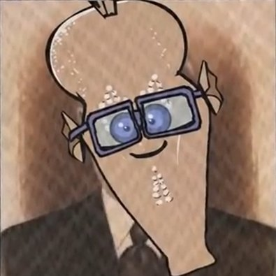

# Kompilator Fiutt'a
>     “Tyle kodu, że ja ********.”
>                   - Teofill Fiutt - docent wydziału mechaniki teoretycznej

## [Instrukcja obsługi](my_compiler/README.md)
## Autor - Jakub Jaśków
